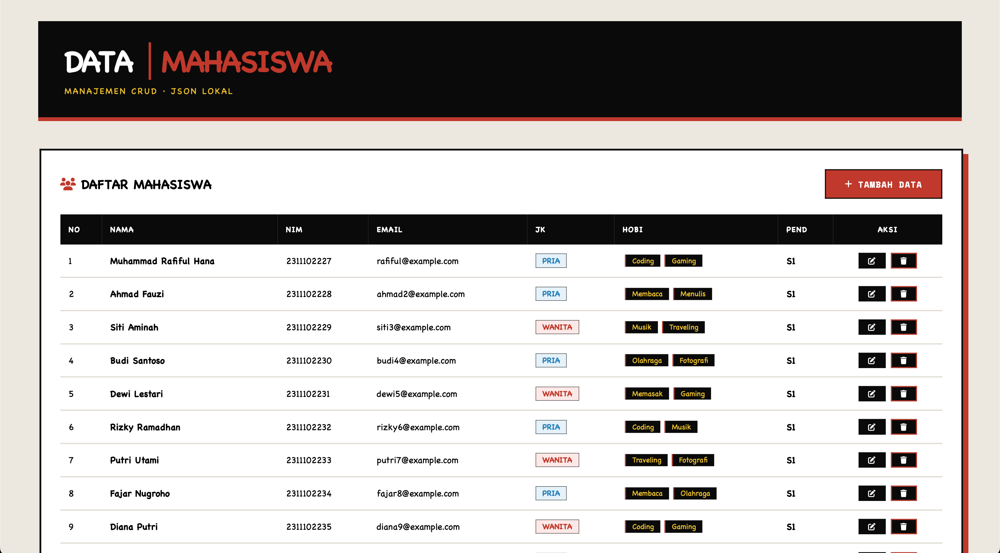
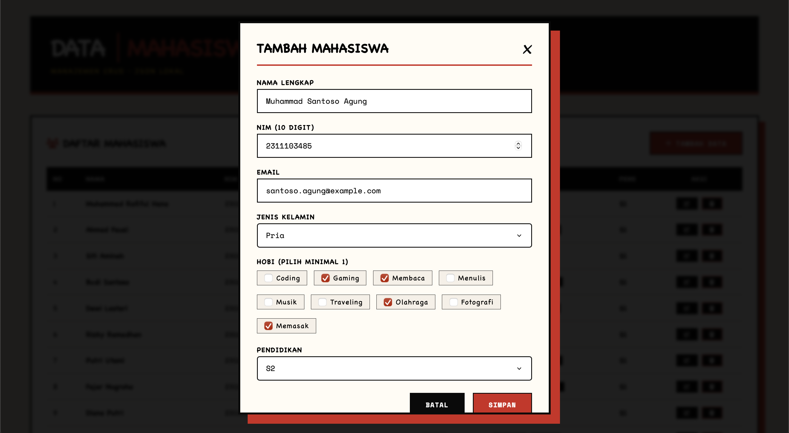
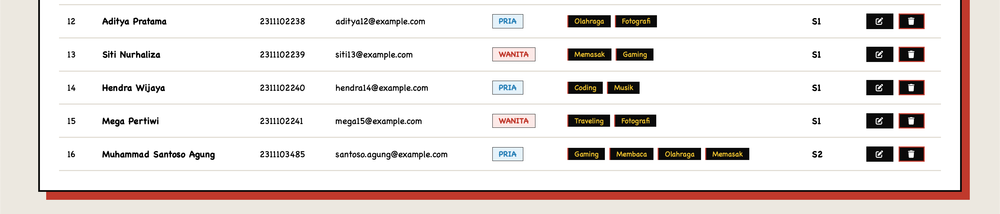
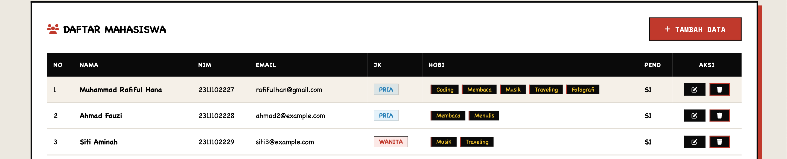
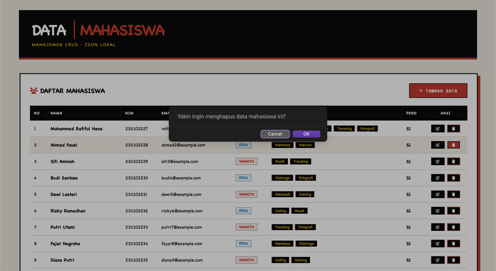
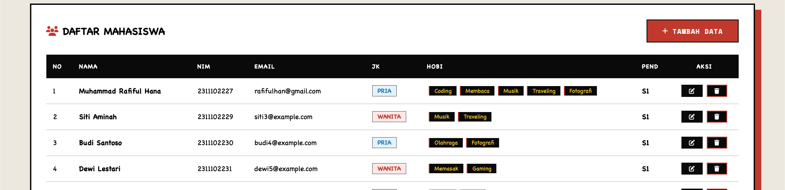

# Aplikasi Manajemen Data Mahasiswa - Laravel CRUD

**Nama:** Muhammad Rafiful Hana  
**NIM:** 2311102227  
**Fakultas:** Teknik Informatika - Telkom University  

---

## Daftar Isi

1. [Deskripsi](#deskripsi)
2. [Fitur Utama](#fitur-utama)
3. [Teknologi](#teknologi)
4. [Screenshots / Output Aplikasi](#screenshots--output-aplikasi)
5. [Instalasi](#instalasi)
6. [Struktur Database (JSON)](#struktur-database-json)
7. [Struktur Folder](#struktur-folder)
8. [Endpoint API](#endpoint-api)
9. [Kode Program](#kode-program)
10. [Cara Penggunaan](#cara-penggunaan)
11. [Troubleshooting](#troubleshooting)
12. [Referensi](#referensi)

---

## Deskripsi

Aplikasi web manajemen data mahasiswa dengan fitur CRUD (Create, Read, Update, Delete) yang dibangun menggunakan framework Laravel. Data disimpan dalam file JSON lokal sehingga tidak memerlukan database MySQL/PostgreSQL. Aplikasi ini menggunakan desain neurobrutalist dengan tampilan yang tegas, kontras, dan ekspresif.

---

## Fitur Utama

1. **Manajemen Data Mahasiswa**
   - Menampilkan daftar mahasiswa dalam tabel
   - Menambah data mahasiswa baru
   - Mengedit data mahasiswa yang sudah ada
   - Menghapus data mahasiswa

2. **Form Input Data**
   - Nama lengkap
   - NIM (10 digit numerik)
   - Email
   - Jenis kelamin (Pria/Wanita)
   - Hobi (checkbox multi-pilihan: Coding, Gaming, Membaca, Menulis, Musik, Traveling, Olahraga, Fotografi, Memasak)
   - Pendidikan (D3, S1, S2, S3)

3. **Tampilan Neurobrutalist**
   - Header hitam dengan aksen merah (#c0392b)
   - Card dengan shadow tebal
   - Tombol dengan efek hover scale
   - Modal dengan desain brutalist
   - Tag hobi dengan gaya unik

4. **Fitur CRUD**
   - Create: Tambah data mahasiswa via modal form
   - Read: Tampilkan data dalam tabel dinamis
   - Update: Edit data melalui modal yang sama
   - Delete: Hapus data dengan konfirmasi

5. **Teknis**
   - Penyimpanan data menggunakan file JSON (`storage/app/mahasiswa.json`)
   - Validasi input di sisi server
   - AJAX request untuk operasi CRUD tanpa reload
   - Toast notification feedback
   - Responsive design

---

## Teknologi

**Backend:**
- Laravel 11
- PHP 8.2+
- File JSON sebagai database

**Frontend:**
- Blade Templating Engine
- jQuery 3.7
- CSS3 Neurobrutalist Design
- Font Awesome 6
- Google Fonts (Space Mono, Inter)

---

## Screenshots / Output Aplikasi

### 1. Halaman Utama (Daftar Mahasiswa)



Halaman utama menampilkan daftar mahasiswa dalam tabel dengan desain neurobrutalist. Header berjudul "DATA MAHASISWA" dengan aksen merah dan tombol "Tambah Data" di pojok kanan.

### 2. Form Tambah Mahasiswa



Modal form untuk menambah data mahasiswa baru dengan input: nama, NIM, email, jenis kelamin, hobi (checkbox), dan pendidikan.

### 3. Hasil Tambah Mahasiswa



Data mahasiswa baru berhasil ditambahkan dan tampil dalam tabel bersama data lainnya. Notifikasi toast sukses muncul di bagian atas.

### 4. Form Edit Mahasiswa


Modal form dalam mode edit, menampilkan data mahasiswa yang sudah ada untuk diubah. Judul modal berubah menjadi "Edit Mahasiswa" dan tombol menjadi "Update".

### 5. Hasil Edit Mahasiswa



Data mahasiswa berhasil diperbarui dan langsung tampil di tabel. Perubahan pada NIM, hobi, atau field lainnya tercermin tanpa reload halaman.

### 6. Konfirmasi Hapus Mahasiswa



Konfirmasi penghapusan menggunakan dialog `confirm()` browser sebelum data benar-benar dihapus.

### 7. Hasil Hapus Mahasiswa



Data mahasiswa berhasil dihapus dan tidak lagi muncul dalam tabel. Notifikasi toast sukses ditampilkan.

---

## Instalasi

1. Clone repository

```bash
git clone <repository-url>
cd source-code
```

2. Install dependencies

```bash
composer install
```

3. Copy file environment

```bash
cp .env.example .env
```

4. Generate application key

```bash
php artisan key:generate
```

5. Beri permission pada folder storage

```bash
chmod -R 775 storage
chmod -R 775 bootstrap/cache
```

6. Jalankan server

```bash
php artisan serve
```

7. Akses aplikasi

Buka browser: http://localhost:8000

---

## Struktur Database (JSON)

Data disimpan dalam file `storage/app/mahasiswa.json` dengan struktur sebagai berikut:

```json
[
    {
        "id": 1,
        "nama": "Muhammad Rafiful Hana",
        "nim": 2311102227,
        "email": "rafiful@example.com",
        "jenis_kelamin": "Pria",
        "hobi": ["Coding", "Gaming"],
        "pendidikan": "S1"
    }
]
```

### Field Description

| Field          | Tipe Data   | Keterangan                        |
|----------------|-------------|-----------------------------------|
| id             | integer     | Auto increment, primary key       |
| nama           | string      | Nama lengkap mahasiswa            |
| nim            | integer     | NIM 10 digit                      |
| email          | string      | Alamat email                      |
| jenis_kelamin  | string      | Pria / Wanita                     |
| hobi           | array       | Array of strings (min 1)          |
| pendidikan     | string      | D3 / S1 / S2 / S3                 |

---

## Struktur Folder

```
source code/
├── output/                            # Screenshot hasil aplikasi
│   ├── 1.main-page.png
│   ├── 2.form-add.png
│   ├── 3.form-add-result.png
│   ├── 4.form-edit.png
│   ├── 5.form-edit-result.png
│   ├── 6.delete-mahasiswa.png
│   └── 7.delete-mahasiswa-result.png
│
├── app/
│   ├── Http/
│   │   └── Controllers/
│   │       └── MahasiswaController.php
│   └── Models/
│
├── bootstrap/
├── config/
├── database/
├── public/
├── resources/
│   └── views/
│       ├── mahasiswa.blade.php         # Halaman utama CRUD
│       └── welcome.blade.php
│
├── routes/
│   └── web.php                        # Route definitions
│
├── storage/
│   └── app/
│       └── mahasiswa.json             # File data JSON
│
├── composer.json
├── package.json
├── artisan
└── vite.config.js
```

---

## Endpoint API

| Method   | Endpoint            | Deskripsi                              |
|----------|---------------------|----------------------------------------|
| GET      | /                   | Halaman utama daftar mahasiswa         |
| GET      | /mahasiswa          | Halaman utama daftar mahasiswa         |
| GET      | /mahasiswa/data     | Ambil semua data mahasiswa (JSON)      |
| POST     | /mahasiswa          | Tambah data mahasiswa baru             |
| PUT      | /mahasiswa/{id}     | Update data mahasiswa berdasarkan ID   |
| DELETE   | /mahasiswa/{id}     | Hapus data mahasiswa berdasarkan ID    |

---

## Kode Program

### Controller MahasiswaController.php

```php
<?php
namespace App\Http\Controllers;

use Illuminate\Http\Request;
use Illuminate\Support\Facades\File;
use Illuminate\Support\Facades\Validator;

class MahasiswaController extends Controller
{
    private function getJsonPath()
    {
        return storage_path('app/mahasiswa.json');
    }

    private function readData()
    {
        $path = $this->getJsonPath();
        if (!File::exists($path)) {
            $default = [
                [
                    'id' => 1,
                    'nama' => 'Muhammad Rafiful Hana',
                    'nim' => 2311102227,
                    'email' => 'rafiful@example.com',
                    'jenis_kelamin' => 'Pria',
                    'hobi' => ['Coding', 'Gaming'],
                    'pendidikan' => 'S1'
                ],
                [
                    'id' => 2,
                    'nama' => 'Ahmad Fauzi',
                    'nim' => 2311102228,
                    'email' => 'ahmad2@example.com',
                    'jenis_kelamin' => 'Pria',
                    'hobi' => ['Membaca', 'Menulis'],
                    'pendidikan' => 'S1'
                ]
            ];
            File::put($path, json_encode($default, JSON_PRETTY_PRINT));
            return $default;
        }
        return json_decode(File::get($path), true) ?? [];
    }

    private function writeData($data)
    {
        File::put($this->getJsonPath(), json_encode($data, JSON_PRETTY_PRINT));
    }

    public function index()
    {
        return view('mahasiswa');
    }

    public function getData()
    {
        return response()->json($this->readData());
    }

    public function store(Request $request)
    {
        $validator = Validator::make($request->all(), [
            'nama' => 'required|string|max:100',
            'nim' => 'required|numeric|digits:10',
            'email' => 'required|email|max:100',
            'jenis_kelamin' => 'required|in:Pria,Wanita',
            'hobi' => 'required|array|min:1',
            'hobi.*' => 'string|max:50',
            'pendidikan' => 'required|in:S1,S2,S3,D3'
        ]);

        if ($validator->fails()) {
            return response()->json(['errors' => $validator->errors()], 422);
        }

        $data = $this->readData();
        $newId = count($data) > 0 ? max(array_column($data, 'id')) + 1 : 1;

        $newData = [
            'id' => $newId,
            'nama' => $request->nama,
            'nim' => (int)$request->nim,
            'email' => $request->email,
            'jenis_kelamin' => $request->jenis_kelamin,
            'hobi' => $request->hobi,
            'pendidikan' => $request->pendidikan
        ];

        $data[] = $newData;
        $this->writeData($data);

        return response()->json(['message' => 'Data berhasil ditambahkan', 'data' => $newData], 201);
    }

    public function update(Request $request, $id)
    {
        $validator = Validator::make($request->all(), [
            'nama' => 'required|string|max:100',
            'nim' => 'required|numeric|digits:10',
            'email' => 'required|email|max:100',
            'jenis_kelamin' => 'required|in:Pria,Wanita',
            'hobi' => 'required|array|min:1',
            'hobi.*' => 'string|max:50',
            'pendidikan' => 'required|in:S1,S2,S3,D3'
        ]);

        if ($validator->fails()) {
            return response()->json(['errors' => $validator->errors()], 422);
        }

        $data = $this->readData();
        $index = array_search((int)$id, array_column($data, 'id'));

        if ($index === false) {
            return response()->json(['message' => 'Data tidak ditemukan'], 404);
        }

        $data[$index] = [
            'id' => (int)$id,
            'nama' => $request->nama,
            'nim' => (int)$request->nim,
            'email' => $request->email,
            'jenis_kelamin' => $request->jenis_kelamin,
            'hobi' => $request->hobi,
            'pendidikan' => $request->pendidikan
        ];

        $this->writeData($data);

        return response()->json(['message' => 'Data berhasil diupdate', 'data' => $data[$index]]);
    }

    public function destroy($id)
    {
        $data = $this->readData();
        $index = array_search((int)$id, array_column($data, 'id'));

        if ($index === false) {
            return response()->json(['message' => 'Data tidak ditemukan'], 404);
        }

        array_splice($data, $index, 1);
        $this->writeData($data);

        return response()->json(['message' => 'Data berhasil dihapus']);
    }
}
```

### Routes (web.php)

```php
<?php
use Illuminate\Support\Facades\Route;
use App\Http\Controllers\MahasiswaController;

Route::get('/', [MahasiswaController::class, 'index']);
Route::get('/mahasiswa', [MahasiswaController::class, 'index']);
Route::get('/mahasiswa/data', [MahasiswaController::class, 'getData']);
Route::post('/mahasiswa', [MahasiswaController::class, 'store']);
Route::put('/mahasiswa/{id}', [MahasiswaController::class, 'update']);
Route::delete('/mahasiswa/{id}', [MahasiswaController::class, 'destroy']);
```

---

## Cara Penggunaan

1. **Melihat Data Mahasiswa**
   - Halaman utama akan menampilkan daftar mahasiswa dalam tabel
   - Data default sudah tersedia saat pertama kali diakses

2. **Menambah Mahasiswa**
   - Klik tombol "Tambah Data"
   - Isi form pada modal yang muncul
   - Pilih minimal 1 hobi
   - Klik "Simpan"

3. **Mengedit Mahasiswa**
   - Klik tombol edit (ikon pensil) pada baris mahasiswa
   - Ubah data yang diperlukan pada form
   - Klik "Update"

4. **Menghapus Mahasiswa**
   - Klik tombol hapus (ikon tempat sampah) pada baris mahasiswa
   - Konfirmasi penghapusan pada dialog
   - Data akan terhapus secara permanen

---

## Troubleshooting

**Error 500 saat akses halaman**
- Pastikan sudah menjalankan `php artisan key:generate`
- Cek permission folder: `chmod -R 775 storage bootstrap/cache`

**File JSON tidak terbaca**
- Pastikan folder `storage/app` memiliki permission write
- File akan dibuat otomatis dengan data default

**Error 419 Page Expired**
- Pastikan CSRF token sudah di-set di meta tag
- Refresh halaman

**Error Class not found**
- Jalankan `composer dump-autoload`

---

## Referensi

- [Laravel 11 Documentation](https://laravel.com/docs/11.x)
- [jQuery Documentation](https://api.jquery.com/)
- [Font Awesome Icons](https://fontawesome.com/icons)
- [Google Fonts - Space Mono](https://fonts.google.com/specimen/Space+Mono)
- [PHP Documentation](https://www.php.net/docs.php)
- [Neurobrutalism Design](https://www.awwwards.com/neuro-brutalism/)
- Telkom University - Program Studi S1 Informatika